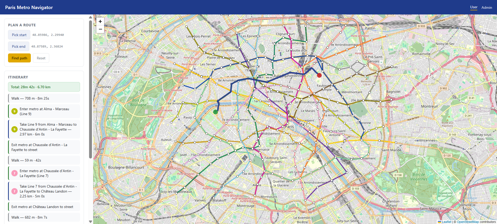

# Paris Metro Navigator

A localhost web application that finds the fastest walk + metro itinerary between any two points in central Paris, with an admin dashboard for simulating real-world disruptions (closed stations, closed segments, full line closures).

The backend models the city as a single weighted graph (walking + metro fused) and runs **A\*** search with a great-circle-distance heuristic. The frontend is a Leaflet map that shows the live Paris metro network and the computed route.

---

## Screenshots

**User page** — click a start and an end point, get a step-by-step itinerary:



---

## Features

- **Multi-modal routing** — walk to the nearest station, ride the metro (with transfers), walk to the destination.
- **Time-optimal A\*** — admissible heuristic guarantees the shortest-time path.
- **Real Paris data** — IDFM GTFS feed for the metro + OpenStreetMap for the walking graph.
- **Admin scenarios** — close a station, a segment of a line, or an entire line. Routes reroute automatically.
- **Line filter** — toggle individual metro lines on/off on the map.
- **No build step** — vanilla JS + Leaflet from a CDN.

---

## How it works

**Graph model.** The city is represented as a single directed weighted graph with five kinds of edges:

| Edge kind | From → To | Weight |
|---|---|---|
| Walk | walk-node ↔ walk-node | `haversine / 1.4 m·s⁻¹` |
| Ride | platform → platform (same line, consecutive stops) | GTFS median travel time |
| Transfer | platform → platform (same station, different line) | 180 s (flat) |
| Entrance | platform ↔ nearest walk-node | `haversine / 1.4 m·s⁻¹` |
| Virtual endpoint | temporary start/end → graph | per-query, rolled back after search |

Each station has **one platform node per line** it serves (so Châtelet has ~5). Transfers are first-class edges, which lets A\* decide whether a transfer is worth the time cost.

**Search.** A\* is run with `f(n) = g(n) + h(n)` where `g` is the true cost so far (seconds) and `h` is the great-circle distance from the current node to the goal divided by a fast upper-bound speed. Dividing by an over-estimate of the fastest edge speed keeps the heuristic **admissible** — A\* is guaranteed to find the optimal path.

**Scenarios.** Admin-created closures are stored in SQLite and compiled into an **in-memory edge mask** at query time. The base graph in RAM is never mutated, so toggling scenarios is instant and safe.

**Virtual endpoints.** When the user clicks a point on the map, the backend projects that click onto the nearest walking edge, splits it with a temporary node, and attaches a virtual start/end node. All temporary state is rolled back after the A\* run — transaction-style.

---

## Tech stack

| Layer | Tool |
|---|---|
| Language | Python 3.11+ |
| Backend framework | FastAPI + Uvicorn |
| Validation | Pydantic v2, pydantic-settings |
| Auth | JWT (`python-jose`) + bcrypt (`passlib`) |
| Database | SQLite (stdlib) |
| Spatial lookup | `scipy.spatial.cKDTree` |
| GTFS preprocessing | pandas |
| OSM query | Overpass API (`requests`) |
| Frontend | Vanilla JS + Leaflet 1.9.4 (CDN) |
| Map tiles | OpenStreetMap |
| Tests | pytest |

---

## Setup

### Prerequisites
- Python 3.11 or newer
- Git
- ~200 MB free disk (GTFS zip + OSM walk graph + SQLite DB)

### Windows (PowerShell)

```powershell
git clone https://github.com/minh2416294/IT3160-ParisMetro
cd IT3160-ParisMetro

python -m venv .venv
.\.venv\Scripts\Activate.ps1

pip install -r requirements.txt

Copy-Item .env.example .env
# then open .env and set ADMIN_USERNAME, ADMIN_PASSWORD, JWT_SECRET
```

### macOS / Linux (bash)

```bash
git clone https://github.com/minh2416294/IT3160-ParisMetro
cd IT3160-ParisMetro

python3 -m venv .venv
source .venv/bin/activate

pip install -r requirements.txt

cp .env.example .env
# then edit .env: set ADMIN_USERNAME, ADMIN_PASSWORD, JWT_SECRET
```

### One-time data build (~5–10 min, downloads ~100 MB)

```bash
python scripts/download_gtfs.py       # IDFM GTFS feed → backend/data/raw/
python scripts/download_walk_osm.py   # Overpass walking graph → backend/data/raw/
python scripts/build_graph.py         # GTFS + OSM → SQLite (platforms, ride/transfer/walk/entrance edges)
python scripts/init_db.py             # create admin table, bcrypt-hash the password from .env
```

### Run the app

```bash
uvicorn backend.app.main:app --reload --port 8000
```

Then open:

- **User page:** http://localhost:8000/
- **Admin page:** http://localhost:8000/admin.html — log in with the credentials from `.env`.

---

## Usage

**User page.** Click the **Start** button, click a point on the map; click **End**, click another point; click **Find Path**. The route is drawn in magenta and the itinerary is listed on the left (walk duration/distance, metro line, transfers, exit walk).

**Admin page.** Log in, then:

- **Close station** — click the button, then click any station on the map.
- **Close segment** — pick the line, click the button, then click two adjacent stations on that line.
- **Close line** — pick the line from the dropdown, click **Close line**.

Active scenarios appear in the list; delete them individually or clear all. Go back to the user tab and click **Find Path** again — routes will avoid the closed infrastructure.

---

## API endpoints

| Method | Path | Auth | Purpose |
|---|---|---|---|
| `GET` | `/api/network` | public | Stations + lines, for map rendering |
| `POST` | `/api/path` | public | Body `{lat_start, lng_start, lat_end, lng_end}` → itinerary |
| `POST` | `/api/auth/login` | public | Body `{username, password}` → JWT |
| `GET` | `/api/scenarios` | public | List active scenarios |
| `POST` | `/api/scenarios` | admin | Create a scenario |
| `DELETE` | `/api/scenarios/{id}` | admin | Delete one scenario |
| `DELETE` | `/api/scenarios` | admin | Clear all scenarios |

Interactive docs are available at http://localhost:8000/docs while the app is running.

---

## Known limitations / out of scope

- **No real-time data.** We use median travel times from a static GTFS snapshot; no live delays, no strike feed.
- **No schedule-aware routing.** Travel times do not depend on time of day.
- **Metro only.** RER, buses, trams, Transilien, and Noctilien are not modelled.
- **Central Paris only.** The walking graph covers roughly the 48.82–48.90 × 2.27–2.42 bounding box.
- **No address search.** Start and end are chosen by clicking on the map — no geocoding.
- **Single best route.** The app returns the optimal path; no alternatives are suggested.
- **No accessibility data.** Stairs/elevators are not modelled.
- **Desktop only.** The layout is not responsive for mobile.
- **Localhost only.** No deployment, Docker, or CI configuration is included.

---

## License & attribution

Course project for IT3160 — provided as-is for educational use.

Third-party data and libraries:

- **Map tiles:** © [OpenStreetMap](https://www.openstreetmap.org/copyright) contributors, served from `tile.openstreetmap.org`.
- **Walking graph:** Derived from OpenStreetMap via the [Overpass API](https://overpass-api.de/), under the [ODbL](https://www.openstreetmap.org/copyright).
- **Metro network:** [IDFM GTFS feed](https://data.iledefrance-mobilites.fr/) (Île-de-France Mobilités), under the [Licence Ouverte 2.0](https://www.etalab.gouv.fr/licence-ouverte-open-licence).
- **Leaflet** © Vladimir Agafonkin — [BSD-2-Clause](https://github.com/Leaflet/Leaflet/blob/main/LICENSE).
- **FastAPI, Uvicorn, Pydantic, SciPy, pandas** — their respective open-source licenses.
